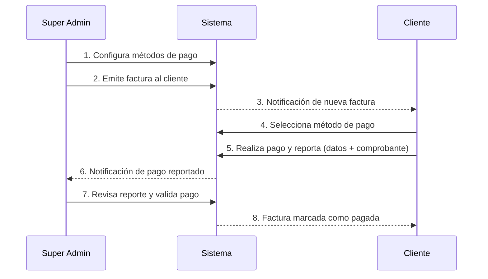

# 💳 Módulo de Facturación de Suscripción (Billing)

> Documentación permanente del flujo de facturación de suscripciones.

---

## Flujo General

---

## Roles y Permisos

| Acción | Super Admin | Cliente |
|--------|:-----------:|:-------:|
| Configurar métodos de pago | ✅ | ❌ |
| Emitir facturas | ✅ | ❌ |
| Ver todas las facturas | ✅ | ❌ |
| Ver sus propias facturas | ❌ | ✅ |
| Reportar pago | ❌ | ✅ |
| Validar/Aprobar pago | ✅ | ❌ |
| Anular factura | ✅ | ❌ |

---

## Métodos de Pago

### Estructura Base (todos los métodos)

| Campo | Tipo | Requerido | Descripción |
|-------|------|:---------:|-------------|
| `name` | TEXT | ✅ | Nombre visible para el cliente |
| `type` | TEXT | ✅ | `mobile_payment`, `bank_transfer`, `zelle`, `binance` |
| `description` | TEXT | ❌ | Descripción/instrucciones para el cliente |
| `is_enabled` | BOOLEAN | ✅ | Si el método está activo |
| `charge_igtf` | BOOLEAN | ✅ | Cobrar 3% IGTF adicional |
| `support_phone_prefix` | TEXT | ❌ | Prefijo: 0412/0414/0416/0422/0424/0426 |
| `support_phone` | TEXT | ❌ | Teléfono de asistencia |

### Datos por Tipo de Método

#### 📱 Pago Móvil (`mobile_payment`)
| Campo en `details` | Descripción |
|---------------------|-------------|
| `phone` | Teléfono del receptor |
| `document` | Cédula o RIF del receptor |
| `bank` | Banco del receptor |

#### 🏦 Transferencia Bancaria (`bank_transfer`)
| Campo en `details` | Descripción |
|---------------------|-------------|
| `bank` | Banco |
| `account_number` | Número de cuenta |
| `beneficiary_name` | Nombre del beneficiario |
| `beneficiary_document` | Documento del beneficiario |
| `email` | Email de notificación |

#### 💵 Zelle (`zelle`)
| Campo en `details` | Descripción |
|---------------------|-------------|
| `email` | Email de Zelle |
| `full_name` | Nombre completo |

#### 🪙 Binance (`binance`)
| Campo en `details` | Descripción |
|---------------------|-------------|
| `email` | Email/ID de Binance |
| `full_name` | Nombre completo |

---

## Datos del Reporte de Pago (Cliente)

### Datos comunes a todos los métodos
| Campo | Tipo | Requerido | Descripción |
|-------|------|:---------:|-------------|
| `payment_reference` | TEXT | ✅ | Número de referencia |
| `proof_url` | TEXT | ❌ | URL del comprobante (imagen o PDF) |

### Datos específicos por método

#### 📱 Pago Móvil
| Campo | Descripción |
|-------|-------------|
| `sender_phone` | Teléfono del emisor |
| `sender_document` | Cédula del emisor |
| `sender_bank` | Banco del emisor |

#### 🏦 Transferencia Bancaria
Solo referencia + comprobante.

#### 💵 Zelle / 🪙 Binance
Solo referencia + comprobante.

---

## OCR de Comprobantes

El cliente puede adjuntar un comprobante (imagen/PDF) al reportar su pago. El sistema intentará extraer datos automáticamente usando la misma arquitectura OCR del proyecto:

1. **BaseOCRService**: Procesamiento de archivo (PDF parse / imagen)
2. **PaymentOCRService** (NUEVO): Prompt especializado para comprobantes de pago → extrae referencia, monto, fecha, banco emisor, teléfono emisor

---

## Tablas de Base de Datos

### `system_invoices`
Facturas del sistema → clientes por suscripción.

### `payment_methods`
Métodos de pago configurados por super_admin.

### `payment_reports`
Reportes de pago enviados por los clientes.

Ver `schema.md` para DDL completo.

---

**Última actualización**: Febrero 2026
